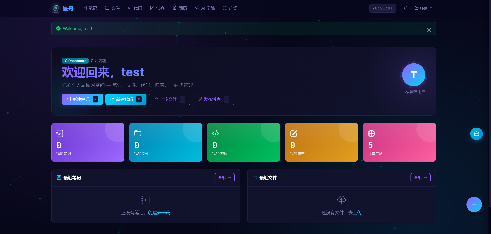
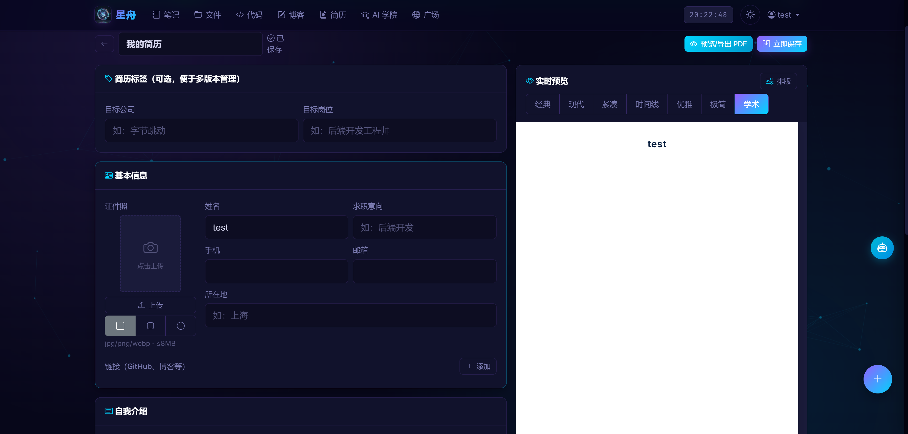
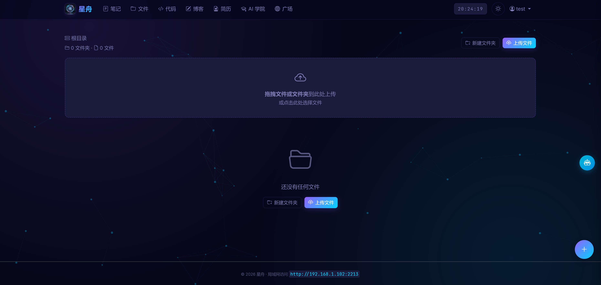
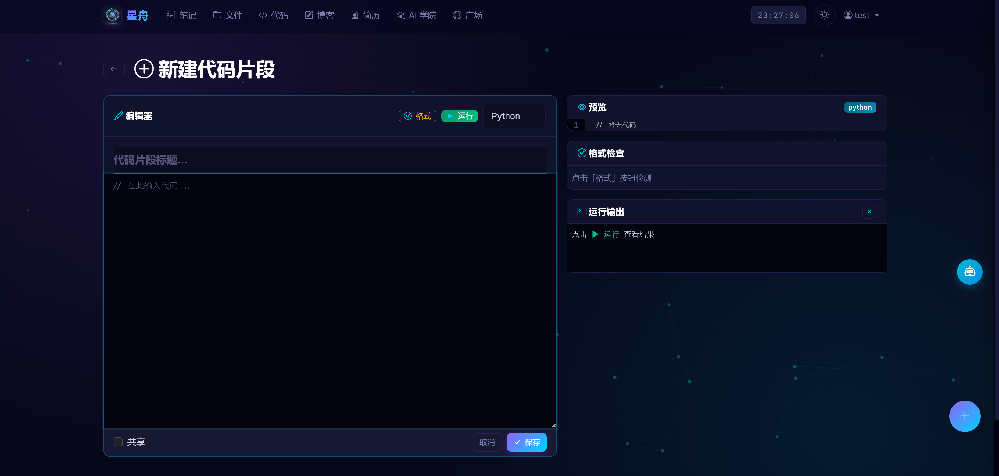
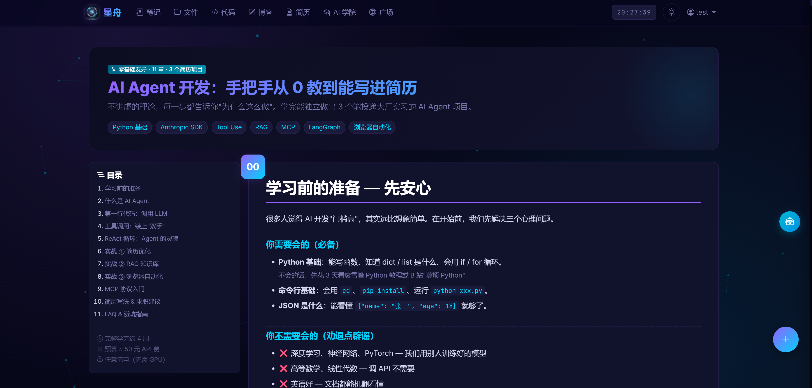
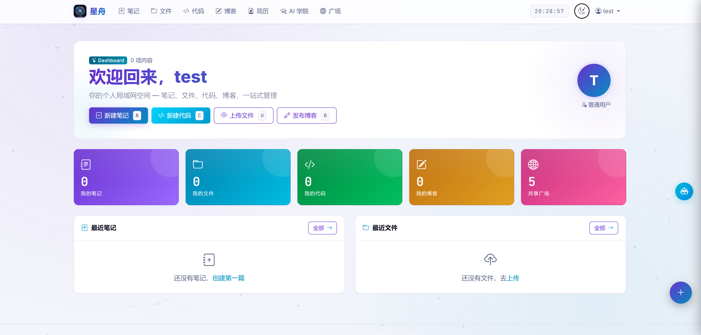

# StarArk — AI 个人空间

> 基于 Python Flask 的局域网个人知识管理平台。集 **笔记、代码、文件、博客、简历制作、AI 学院、共享广场、AI 助手** 于一体，支持多用户、权限分级、一键导出高清 PDF 简历。

站点名称、上传限制、使用指南等均可在后台自定义（默认名 `StarArk`）。

> ℹ️ 个人自用项目，按自己需要随时新增功能。

---

## 目录

- [截图展示](#截图展示)
- [功能总览](#功能总览)
- [界面与交互特性](#界面与交互特性)
- [快速开始](#快速开始)
- [管理员配置](#管理员配置)
- [权限体系](#权限体系)
- [简历系统详解](#简历系统详解)
- [AI 学院](#ai-学院)
- [AI 助手配置](#ai-助手配置)
- [开机自启与持续运行](#开机自启与持续运行)
- [数据库配置](#数据库配置)
- [环境变量参考](#环境变量参考)
- [项目结构](#项目结构)
- [API 接口](#api-接口)
- [技术栈](#技术栈)
- [常见问题](#常见问题)

---

## 截图展示

> 截图统一放在 `docs/screenshots/` 目录下。下方为各页面预览，把对应文件放进去即可自动显示。

### 首页 · 控制台



<sub>英雄区 + 统计卡片（数字滚动动画）+ 最近笔记/文件，背景为粒子网络。</sub>

### 简历编辑（实时预览 + 排版面板）



<sub>左侧表单 + 右侧所见即所得预览，顶部可切换 7 套模板，「排版」面板调节字号 / 行距 / 字体 / 页边距。共「经典 / 现代 / 紧凑 / 时间线 / 优雅 / 极简 / 学术」7 套模板，均支持导出高清矢量 PDF。</sub>

### 文件管理



<sub>拖拽上传、文件夹管理、在线预览（图片 / PDF / 音视频 / CSV / 代码）、行内重命名。</sub>

### 代码片段（语法高亮 + 在线执行）



<sub>24+ 语言高亮，Python 沙箱在线执行，格式 / 语法检查。</sub>

### AI 学院 · AI Agent 实战教程



<sub>11 章零基础教程 + 3 个可写进简历的实战项目，含代码高亮、架构图、面试题。</sub>

### 亮色主题



<sub>一键切换暗 / 亮主题，无刷新闪烁。</sub>

---

> **如何添加截图**：在项目根目录新建 `docs/screenshots/` 文件夹，按上方文件名（如 `home.png`、`resume-edit.png`）放入截图即可。推荐宽度 1280px、PNG 格式。

---

## 功能总览

| 模块 | 说明 |
|------|------|
| 📝 **笔记** | Markdown 编辑与实时预览，一键共享到广场 |
| 💻 **代码** | 24+ 语言语法高亮，Python 在线执行（沙箱 8s 超时），格式/语法检查 |
| 📁 **文件** | 上传 / 在线预览 / 在线编辑，支持图片、PDF、音视频、CSV、代码、文本；拖拽上传、文件夹管理、行内重命名 |
| ✍️ **博客** | Markdown 排版，公开或私密发布 |
| 📄 **简历** | 可视化编辑、证件照上传、**7 套模板**、排版微调、超页检测、**一键适配 1 页**、导出高清矢量 PDF |
| 🎓 **AI 学院** | 内置《AI Agent 开发实战》零基础教程，11 章 + 3 个可写进简历的实战项目 |
| 🌐 **广场** | 全站共享内容聚合，含可折叠使用指南 |
| 🤖 **AI 助手** | 侧边栏对话式助手（接入 DeepSeek），按页面上下文自动切换角色 |
| ⚙️ **管理** | 站点设置、上传限制、指南编辑、用户管理、数据导出（超管） |

---

## 界面与交互特性

- **暗色 / 亮色主题**：一键切换，无刷新闪烁，记忆偏好
- **键盘快捷键**：`N` 笔记 / `C` 代码 / `U` 文件 / `B` 博客 / `R` 简历 / `S` 广场 / `H` 首页
- **悬浮 FAB 快捷菜单** + 回到顶部按钮
- **视觉动效**：粒子网络背景（自适应数量 / 后台暂停 / 尊重 `prefers-reduced-motion`）、滚动渐显、统计数字滚动、卡片 3D 倾斜
- **响应式布局**：手机 / 平板 / 桌面自适配
- **多标签会话**：基于 token 的会话透传，支持同一浏览器多账号
- **无障碍**：追踪保护安全存储封装、reduced-motion 降级

---

## 快速开始

### 环境要求

- Python 3.8+（推荐 3.10+）
- Windows / Linux / macOS
- 无需 GPU

### 安装

```bash
# 1. 进入项目目录
cd personal-site

# 2. （推荐）创建虚拟环境
python -m venv .venv
# Windows
.venv\Scripts\activate
# macOS / Linux
source .venv/bin/activate

# 3. 安装依赖
pip install -r requirements.txt

# 4. 启动（默认热更新，改代码自动重载）
python app.py
```

访问 `http://localhost:2213`，局域网内其他设备通过 `http://你的IP:2213` 访问。

> 启动时控制台会自动打印局域网访问地址（已过滤虚拟网卡 / 代理网卡）。

---

## 管理员配置

### 创建超管账户

首次启动前设置环境变量，启动后超管自动创建：

```bash
# Windows PowerShell
$env:ADMIN_USERNAME = "admin"
$env:ADMIN_PASSWORD = "your_password"

# Linux / macOS
export ADMIN_USERNAME=admin ADMIN_PASSWORD=your_password
```

未设置密码则不创建超管。超管账户**仅能通过环境变量创建**，无法在网页注册。

### 超管功能入口

| 功能 | 路径 |
|------|------|
| 系统仪表盘 | `/admin` |
| 站点设置 | `/admin/settings` |
| 用户管理 | `/admin/users` |
| 用户数据导出（JSON） | 用户列表每行的导出按钮 |

---

## 权限体系

| 操作 | 普通用户 | 管理员 | 超管 |
|------|:--:|:--:|:--:|
| 管理自己的内容 | ✓ | ✓ | ✓ |
| 审批新注册用户 | ✗ | ✓ | ✓ |
| 浏览全站内容 | ✗ | ✗ | ✓ |
| 访问管理仪表盘 | ✗ | ✓ | ✓ |
| 修改站点设置 | ✗ | ✓ | ✓ |
| 管理用户（增删 / 升降级 / 导出） | ✗ | ✗ | ✓ |

> 新用户注册后需管理员审批方可登录。管理员由超管在用户管理页设置；超管仅由环境变量创建。

---

## 简历系统详解

简历模块是本平台的核心特色，从编辑到导出全流程闭环。

### 字段结构

| 模块 | 字段 |
|------|------|
| 基本信息 | 姓名、求职意向、手机、邮箱、所在地、**证件照**、自定义链接（GitHub / 博客等） |
| 自我介绍 | 多行文本 |
| 教育经历 | 学校、专业、学历、起止、GPA / 排名、描述 |
| 工作经历 | 公司、职位、起止、地点、职责描述 |
| 项目经历 | 项目名、角色、起止、技术栈、**描述 / 个人贡献 / 成果**（三段分离） |
| 技能 | 分类 + 技能项（Grid 排版，自动换行防溢出） |
| 奖项 / 证书 | 名称、时间、说明 |

### 证件照上传

- 支持 jpg / jpeg / png / webp，≤ 8MB
- 三种形状：方形 / 圆角 / 圆形
- 存储于用户独立目录 `resume_photos/`，不混入文件管理列表

### 7 套模板

| 模板 | 风格 |
|------|------|
| 经典 | 黑色分隔线，正式商务 |
| 现代 | 紫色侧边竖条 |
| 紧凑 | 小字号密间距，一页放更多 |
| 时间线 | 经历带左侧时间轴 + 圆点 |
| 优雅 | Georgia 衬线 + ◆ 分隔，书卷气 |
| 极简 | 黑白纯线条，瑞士风 |
| 学术 | 深蓝标题栏，适合科研 / 读研背景 |

### 排版微调（实时生效）

- **字号** 80%–150%、**行距** 1.0–2.8、**段落间距** 1–20mm
- **字体**：无衬线 / 英文衬线 / 中文宋体 / 中文黑体 / 等宽
- **页边距**：窄 / 默认 / 宽
- 所有标题、正文按 `em` 等比缩放，调整字号时整体比例协调

### 超页检测 + 一键适配 1 页

- 实时检测内容是否超出 A4，超页给出徽章 / 横幅提示
- **「一键适配 1 页」**：二分搜索最大可行字号，内容偏短时自动增大行距 / 段距填满整页，做到不溢出也不留大片空白

### 高清 PDF 导出

- 浏览器原生打印 → 另存为 PDF，**矢量、无依赖、A4 标准**
- 打印时自动隐藏导航栏、AI 助手、浮动按钮、阴影边框等所有非简历元素
- 多版本管理：一键复制简历，针对不同公司独立调整

---

## AI 学院

内置《**AI Agent 开发实战 — 小白也能学会**》完整教程，路径 `/learn/ai-agent`：

- **11 章**：从「什么是 Agent」到环境搭建、工具调用、ReAct 循环、MCP 协议
- **3 个实战项目**（均附「可直接写进简历」的项目描述模板）：
  1. 简历优化 Agent（Tool Use + ReAct）
  2. RAG 个人知识库 Agent（ChromaDB + Embedding）
  3. 浏览器自动化 Agent（Playwright + Computer Use）
- 含代码高亮、ASCII 架构图、故障排查、面试题、求职建议、4 周学习路径

---

## AI 助手配置

侧边栏对话式 AI 助手，接入 **DeepSeek**，会根据当前页面自动切换角色（论文助手 / 代码工程师 / 写作编辑等）。

### 配置 API Key（任选其一）

**方式一：后台设置（推荐）**
管理 → 站点设置 → 填入 DeepSeek API Key → 保存（密钥存于 `user_data/deepseek_key.txt`）。

**方式二：环境变量**
```bash
export DEEPSEEK_API_KEY=sk-xxxxxxxx
```

读取优先级：`user_data/deepseek_key.txt` > 环境变量 `DEEPSEEK_API_KEY`。

> AI 助手接口已加登录鉴权，未登录用户无法消耗你的 API 额度。

---

## 开机自启与持续运行

### 方案一：双击运行（推荐）

双击 `start.bat` 即可启动。

- **自动探测 Python**：优先环境变量 `NEURALSPACE_PYTHON` → conda `site` 环境 → 系统 `python`
- **守护循环**：服务意外退出后 5 秒自动重启，`Ctrl+C` 永久停止

如需登录后自动启动：把 `start.bat` 的快捷方式放进「启动」文件夹
（`Win + R` 输入 `shell:startup` 打开该目录），快捷方式属性里可设为「最小化」运行。

### 方案二：Windows 服务（可选，无窗口后台）

```powershell
# 下载 nssm: https://nssm.cc/download
nssm install StarArk "C:\path\to\python.exe" "E:\path\to\app.py"
nssm set StarArk AppDirectory "E:\path\to\personal-site"
nssm set StarArk Start SERVICE_AUTO_START
nssm start StarArk
```

> 局域网访问需放行 2213 端口：以管理员运行
> `New-NetFirewallRule -DisplayName "StarArk" -Direction Inbound -Protocol TCP -LocalPort 2213 -Action Allow`

---

## 数据库配置

### 默认（SQLite，零配置）

数据库自动创建于 `user_data/data.db`，每次启动自动备份到 `user_data/data.db.backup`，并自动执行轻量迁移（新增列自动 `ALTER TABLE`）。

### MySQL / PostgreSQL

设置 `DATABASE_URL` 环境变量：

```bash
# MySQL（已内置 pymysql 驱动）
export DATABASE_URL="mysql+pymysql://用户名:密码@主机:3306/数据库名"

# PostgreSQL（需自行 pip install psycopg2-binary）
export DATABASE_URL="postgresql://用户名:密码@主机:5432/数据库名"
```

首次启动自动建表。切换数据库后需重新设置环境变量创建超管。

---

## 环境变量参考

| 变量 | 默认值 | 说明 |
|------|--------|------|
| `ADMIN_USERNAME` | `admin` | 超管用户名 |
| `ADMIN_PASSWORD` | 无 | 超管密码（必填才创建超管） |
| `SECRET_KEY` | 随机生成 | Flask Session 密钥（生产环境建议固定） |
| `DATABASE_URL` | `sqlite:///user_data/data.db` | 数据库连接串 |
| `DEEPSEEK_API_KEY` | 无 | AI 助手密钥（也可在后台配置） |
| `HOT_RELOAD` | `1` | 热更新 / debug 开关 |
| `HOST` | `0.0.0.0` | 监听地址 |
| `PORT` | `2213` | 监听端口 |
| `NEURALSPACE_PYTHON` | 无 | `start.bat` 指定 Python 解释器路径 |

---

## 项目结构

```
personal-site/
├── app.py                      # Flask 主程序（模型 / 路由 / 业务逻辑）
├── start.bat                   # 守护启动脚本（自动探测 Python）
├── requirements.txt            # Python 依赖
├── README.md                   # 本文件
├── .gitignore
├── user_data/                  # 用户数据（与代码分离，已 gitignore）
│   ├── data.db                 # SQLite 数据库
│   ├── data.db.backup          # 启动自动备份
│   ├── deepseek_key.txt        # AI 助手密钥
│   └── uploads/                # 用户上传文件
│       └── <用户名>/
│           ├── ...             # 文件管理的文件
│           └── resume_photos/  # 简历证件照
├── templates/
│   ├── base.html               # 基础布局（导航 / 粒子 / 主题 / 快捷键 / 弹窗逃逸）
│   ├── index.html              # 首页（英雄区 / 统计 / 最近动态）
│   ├── login.html / register.html / change_password.html
│   ├── notes.html / note_form.html / note_view.html
│   ├── files.html / file_preview.html
│   ├── code.html / code_form.html / code_view_detail.html
│   ├── blog.html / blog_form.html / blog_view.html
│   ├── resume.html             # 简历列表
│   ├── resume_form.html        # 简历编辑（实时预览 + 排版面板）
│   ├── resume_view.html        # 简历预览 / 导出 PDF
│   ├── learn_ai_agent.html     # AI Agent 教程
│   ├── shared.html             # 共享广场
│   ├── ai_chat.html            # AI 助手侧栏组件
│   ├── admin.html / admin_users.html / admin_settings.html
│   └── error.html
└── static/
    ├── style.css               # 全站样式（含简历 / 教程 / 打印样式）
    ├── logo.png / favicon.png / favicon.ico
```

---

## API 接口

### 笔记 / 代码 / 博客

标准 RESTful：`/notes`、`/code`、`/blog` 各自含 `new` / `<id>` / `<id>/edit` / `<id>/delete` / `<id>/toggle-share`。

### 文件操作

| 方法 | 路径 | 说明 |
|------|------|------|
| POST | `/files/upload` | 上传（支持拖拽 / 文件夹 / 多文件） |
| GET | `/files/<id>/download` | 下载 |
| GET | `/files/<id>/raw` | 内联提供 |
| GET | `/files/<id>/preview` | 在线预览 |
| POST | `/files/<id>/save` | 保存编辑内容 |
| POST | `/files/<id>/rename` | 重命名 |
| POST | `/files/<id>/move` | 移动到文件夹 |
| POST | `/files/<id>/delete` | 删除 |
| POST | `/files/<id>/toggle-share` | 切换共享 |
| POST | `/files/folder/create` | 创建文件夹 |
| POST | `/files/folder/<id>/rename` | 重命名文件夹 |
| POST | `/files/folder/<id>/delete` | 删除文件夹 |

### 简历操作

| 方法 | 路径 | 说明 |
|------|------|------|
| POST | `/resume/new` | 新建简历 |
| GET | `/resume/<id>` | 预览 / 导出 |
| GET/POST | `/resume/<id>/edit` | 编辑（POST 为 JSON 自动保存） |
| POST | `/resume/<id>/duplicate` | 复制为新版本 |
| POST | `/resume/<id>/delete` | 删除 |
| POST | `/resume/<id>/style` | 保存排版设置 |
| POST | `/resume/<id>/photo` | 上传证件照 |
| GET | `/resume/<id>/photo/<filename>` | 读取证件照 |
| POST | `/resume/<id>/photo/delete` | 删除证件照 |
| POST | `/resume/<id>/photo/shape` | 切换照片形状 |

### 代码执行

| 方法 | 路径 | 说明 |
|------|------|------|
| POST | `/code/<id>/run` | 执行已保存代码（仅 Python） |
| POST | `/code/run` | 直接执行编辑器代码 |
| POST | `/code/check` | 格式 / 语法检查 |

### AI 助手

| 方法 | 路径 | 说明 |
|------|------|------|
| POST | `/api/ai/chat` | 对话（需登录，接入 DeepSeek） |

---

## 技术栈

| 层 | 技术 |
|----|------|
| 后端 | Python 3 · Flask 3 · Flask-Login · Flask-SQLAlchemy |
| 数据库 | SQLite（默认）/ MySQL / PostgreSQL |
| 前端 | Bootstrap 5.3 · Bootstrap Icons · 原生 JS（无构建步骤） |
| Markdown | python-markdown + bleach（XSS 过滤） |
| PDF 解析 | PyPDF2（AI 助手读取 PDF 上下文） |
| AI | DeepSeek Chat API |
| 代码高亮 | highlight.js（教程页） |

安全要点：密码 `werkzeug` 哈希存储、Markdown / HTML 经 bleach 清洗、文件名 sanitize 防路径穿越、登录跳转校验防开放重定向、AI 接口登录鉴权。

---

## 常见问题

**Q：启动报错 `ModuleNotFoundError`**
```bash
pip install -r requirements.txt
```
确认用的是装了依赖的那个 Python / 虚拟环境。

**Q：局域网其他设备打不开**
- 确认防火墙放行 2213 端口（见「开机自启」章节的防火墙命令）
- 用控制台打印的局域网 IP，不要用 `127.0.0.1`
- 若装了 VPN / 代理软件，把本机 IP 加入代理绕过列表

**Q：如何修改端口**
```powershell
$env:PORT = "8080"; python app.py
```

**Q：导出的 PDF 有杂边 / 多一页**
打印窗口里：纸张选 A4、边距选「默认」或「无」、勾选「背景图形」；或先在预览页点「一键适配 1 页」。

**Q：AI 助手提示要配置 Key**
管理 → 站点设置 → 填入 DeepSeek API Key。

**Q：Python 在线执行安全吗**
代码在临时目录以子进程运行，限制 8 秒超时。仅供局域网个人使用，请勿暴露公网。

**Q：忘记超管密码**
重新设置 `ADMIN_PASSWORD` 环境变量后重启，会自动重置该超管密码。

**Q：如何备份全部数据**
复制整个 `user_data/` 目录即可（含数据库与所有上传文件）。

---

## 许可

仅供个人 / 局域网使用。
